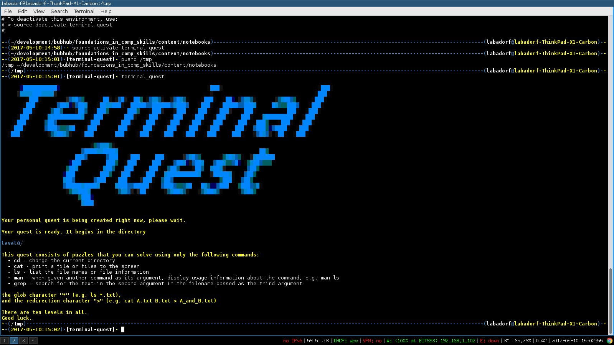

# Introduction

`terminal-quest` is a [gamified](https://en.wikipedia.org/wiki/Gamification)
introduction to basic command line navigation and file manipulation skills. It
is implemented in Python but requires no programming beyond entering commands on
the command line.

`terminal-quest` is a series of puzzles that can be solved with only the
commands **cd**, **ls**, **man**, **cat**, **head**, **tail**, **grep**, file
globbing (`*` character), and output redirection (`>` character).



## Installation and Use ##

### pypi ###

Create and activate a virtual environment, then install with `pip`:

```
python3 -m venv .venv
source .venv/bin/activate
python -m pip install .
```

### Manual Installation ###

If you just want to play from a clone of this repository, you do not need to
install any third-party packages. Clone the repo:

```
git clone https://github.com/BU-Neuromics/terminal_quest
```

or simply download the most recent stable version from [the downloads
page](https://github.com/BU-Neuromics/terminal_quest/tags).

Once downloaded (and expanded, if downloaded as an archive), open a terminal
and run from within the source directory:

```
python3 -m venv .venv
source .venv/bin/activate
python -m terminal_quest
```

### Dependencies ###

Current versions run with the Python standard library only.

## terminal temple

If you enjoyed terminal quest, be sure to check out the sequel
[terminal temple](https://bu-neuromics.github.io/terminal_temple/)
