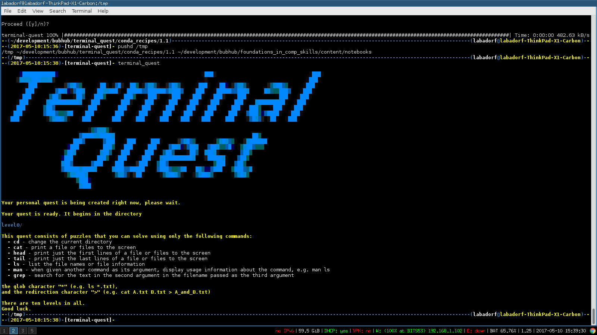

# Introduction

`terminal-quest` is a [gamified](https://en.wikipedia.org/wiki/Gamification)
introduction to basic command line navigation and file manipulation skills. It
is implemented in the python programming language but requires no programming
other than entering commands on a command line. 

`terminal-quest` is a series of puzzles that can be solved with only the
commands **cd**, **ls**, **man**, **cat**, **head**, **tail**, **grep**, file
globbing (`*` character), and output redirection (`>` character).



## Installation and Use ##

### pypi ###

You can install `terminal-quest` using `pip`:

```
pip install terminal-quest
```

### Manual Installation ###

If you do not have access to anaconda, you may also install this package
manually. You can either clone this repo to your local machine with:

```
git clone https://github.com/BU-Neuromics/terminal_quest
```

or simply download the most recent stable version from [the downloads
page](https://github.com/BU-Neuromics/terminal_quest/tags).

Once downloaded (and expanded, if downloaded as an archive), open a terminal
and run from within the source directory:

```
python setup.py install
terminal_quest
```

### Dependencies ###

This package uses the following non-standard python packages:

* [future](https://pypi.python.org/pypi/future)
* [fabulous](https://pypi.python.org/pypi/fabulous)
* [pillow](https://python-pillow.org/)
